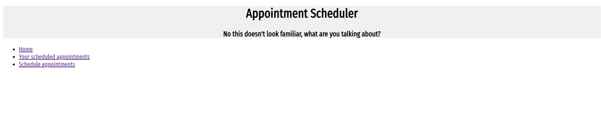
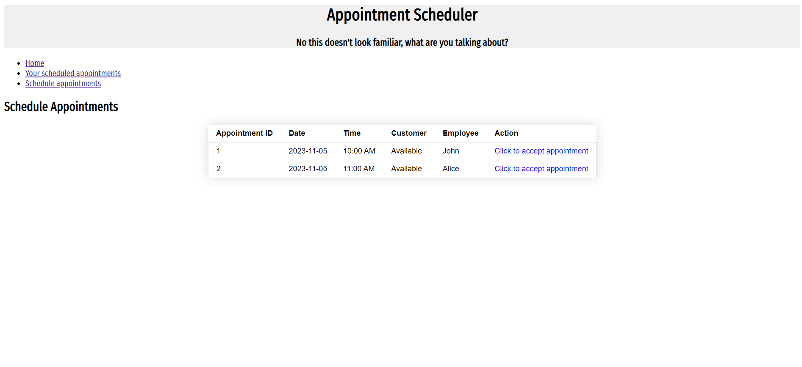
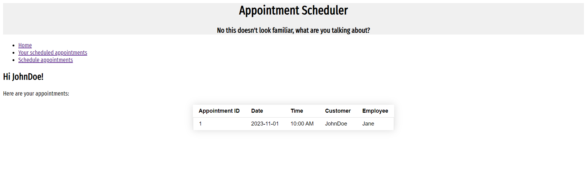
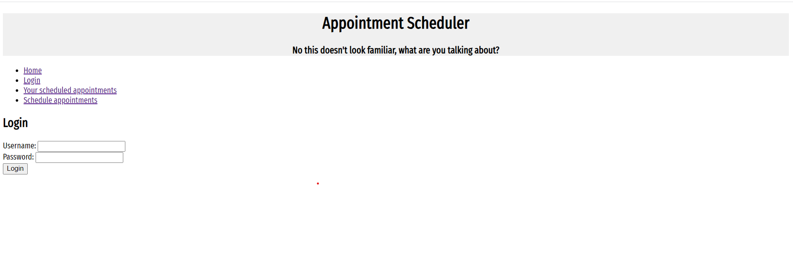

# Nondescript Business with appointments

## Overview


You're an up and coming hair salon/tattoo shop/other appointment making business, and you've got lots of time, but you need a way for your customers to set up an appointment. No one likes waiting on the phone anymore, so you choose __Nondescript Business with appointments__!

Nondescript Business with appointments is the business website that allows users to schedule appointments with our various workers. Users can register and login. Once they're logged in, they can view their scheduled appointments, and appointment-taking employees may log in to view their scheduled appointments.


## Data Model


<!-- The application will store Customers, Managers, Appointment types, timeslots, and ATE. -->
The application will store Customers, Appointments, and Employees.

* All Users will have a username and hash corresponding to a password, and a list of appointments.
* Customers will have notes only viewable by employees
* Employees:  Can manage own appointments and availability 
  <!-- * Owner - Can Manage both managers and ATE's, and global appointments
  * Manager - Can manage ATE's and global appointments -->
* each appointment will have a generated ID, date, time, associated customer, and associated employee.

An Example Customer:

```javascript
{
    username: 'BaldingBob',
    hash: '#',
    appointments: {
        type: [{ type: mongoose.Schema.Types.ObjectId, ref: 'Appointment' }],
        default: [],
    },
    notes: 'very rude'
}
```

An Example Employee:

```javascript
{
  username: "JohnWorker",
  hash: '#',

  Appointments: 
[
  Appointment {
    id: 1698696243886,
    date: '2023-11-01',
    time: '10:00 AM',
    customer: { name: 'John' },
    employee: { name: 'Alice' },
  },
  Appointment {
    id: 1698696243883,
    date: '2023-11-02',
    time: '10:00 AM',
    customer: { name: 'John' },
    employee: { name: 'Alice' },

  }
]
}
```

## [Link to Commented First Draft Schema](db.mjs) 

## Wireframes

/ - home, show other links



/appointments/own - page for showing all the user's appointments



/appointments/schedule - page for scheduling an appointment



/login - page for logging in



The above images are placeholders until I can get calendly to work.

The website will currently operate on individual calendly accounts, but can be adapted to support teams.

## Site map
```
       Home ('/')
       /  |  \
 /login   Own  Schedule
('/login')('appointments/own')('appointments/schedule')
```

## User Stories or Use Cases

1. as a registered user, I can log into my account
2. as a customer, I can schedule an appointment with a worker
3. as a worker, I can create an appointment with a user, registered or not
4. as a customer, I can schedule an appointment from the list of available appointments with an employee 
5. as a user, I can view all my scheduled appointments

Remains to be implemented: confirmation between customers and employees, and improvements to the scheduling system. Currently, calendly takes information about availability from the employee's URI.

## Research Topics

* (3 points) Use a CSS framework or UI toolkit, use a reasonable of customization of the framework - Bootstrap
* (2 points) Use Calendly API for appointment scheduling
* (3 points) dotenv configuration management

10 points total out of 10 required points


## [Link to Initial Main Project File](app.mjs) 

## Annotations / References Used

Handlebars layout and app.mjs skeleton based off projects 3 and 4.

